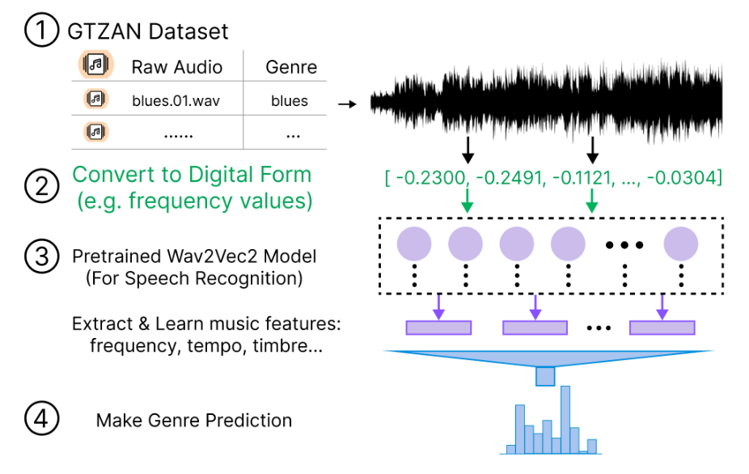

# Music Genre Classification

## Download project & Install requirements
- If you have installed and used git before, then run the following command to clone the project
```
git clone https://github.com/Lorenayannnnn/music_genre_classification
cd music_genre_classification
```
- If not:
  - Directly go to the [github repo](https://github.com/Lorenayannnnn/music_genre_classification)
  - Click the ```Code``` button
  - Click ```Download ZIP```
  - Decompress the ZIP file and run ```cd music_genre_classification``` inside the terminal

- Before installing requirements, please make sure that you have downloaded python and pip on your computer
- Then run:
```
virtualenv -p $(which python3) ./venv
source ./venv/bin/activate
pip3 install -r requirements.txt
```

## Overview

The figure above displays the overview of the project:
- The dataset that is used is called GTZAN, which contains raw music audio and their corresponding genre. For more details, please refer to the [Dataset](#Dataset) section.
- The raw audios will be first loaded and converted to digitized form using ```torchaudio```
- The digital forms will be passed into the pretrained Wav2Vec2 Model, which will be trained to extract and learn music features such as frequency, tempo, timbre, etc.
- The model at last will calculate the probability of the input audio being classified as each specific genre


### Dataset
Please follow the instructions to prepare the dataset:
- Go to the [Kaggle Website](https://www.kaggle.com/datasets/andradaolteanu/gtzan-dataset-music-genre-classification) and download the dataset.
- Decompress the ZIP file, create a directory called ```data``` under the project folder, and move all the decompressed data into the folder.
- The ```data``` directory should contain the following files:
```
└── data 
    └── genres_original
        ├── blues
            ├── blues.00000.wav
            └── ...
        ├── classical
        └── ...
    └── images_original
        ├── blues
            ├── blues00000.png
            └── ...
        ├── classical
        └── ...
    └── features_3_sec.csv
    └── features_30_sec.csv
```

### Run the code
- Go to ```train.sh``` file and change ```YOUR_OUTPUT_DIR_NAME``` to your output directory name 
- run ```bash train.sh```


### Model
- In the project, the pretrained Wav2Vec2 language model that is used can be found [here](https://huggingface.co/facebook/wav2vec2-large-960h-lv60-self).
- The predictions of a biased model (a smaller version of the Wav2Vec2 model) and a main model (a larger version) are combined together when training. 
- When making predictions, only the main model is used for processing the audio.


### Performance & Conclusion
- For experiment results, please go to the [google sheet](https://docs.google.com/spreadsheets/d/1qA18J-7PjgydmwdFhpavdlmgKMQObeT50xbEw9NHqRw/edit?usp=sharing) for more details.
- The final accuracy is approximately 74%. Although it is lower than accuracy of existing works, this performance is still much higher than random guessing, which is 10% given that the used dataset has 10 genres in total. This result can be used to illustrate the connections among human brain, music, and language to some extent, as the result indicates that a model that is originally for processing human speech is able to learn the underlying music features of input raw audios. 
